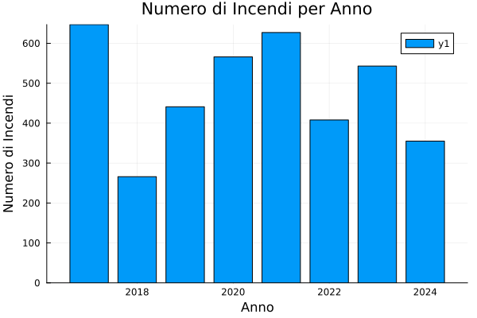
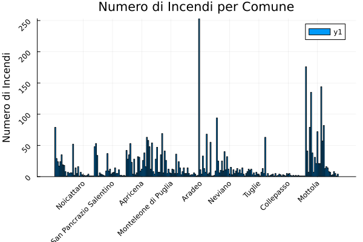
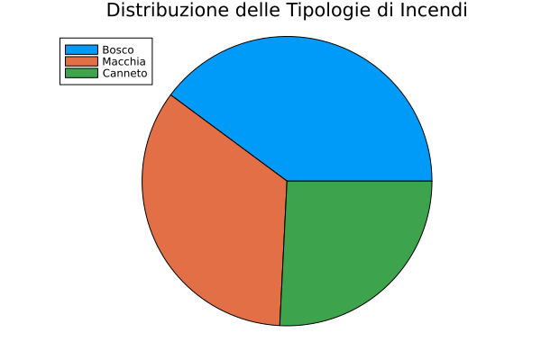
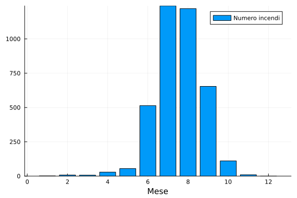
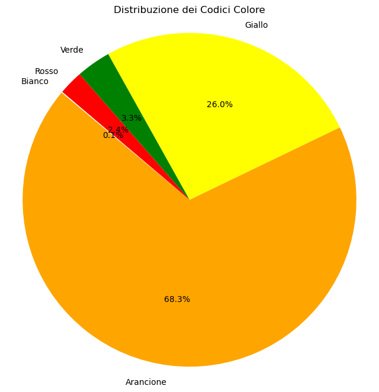

---
title: "Approfondimento Incendi Boschivi Pugliesi"
author: [Losurdo Mauro]
keywords: [Icon project]
titlepage-color: "FFFFF0"
toc-own-page: true
titlepage: true
toc: true
...
# Introduzione

il presente caso di studio si propone, tramite uno studio del dataset fornito dalla regione puglia[^Puglia-dataset], di ricavare informazioni utili per la prevenzioni degli incendi.

## Requisiti funzionali

Il progetto è stato realizzato in Julia è un linguaggio di programmazione ad alte prestazioni, progettato per il calcolo numerico e scientifico, che combina la velocità del C con la facilità d'uso di Python.

librerie utilizzate

- MLJ.ij[@Blaom2020]

--- 
# Dataset 

## informazioni base

Il dataset dataset-incendi-vito-martella.csv contiene informazioni sugli incendi avvenuti in diverse località della regione Puglia. Ogni riga rappresenta un singolo evento di incendio e include le seguenti colonne:

1. DATA: La data dell'incendio (formato YYYY-MM-DD).
1. COMUNE: Il comune in cui è avvenuto l'incendio.
1. LOCALITA': La località specifica all'interno del comune.
1. LAT: La latitudine della località dell'incendio.
1. LONG: La longitudine della località dell'incendio.
1. TIPOLOGIA: Il tipo di area colpita dall'incendio (es. Bosco, Macchia).
1. CODICE COL: Un codice colore associato all'incendio (es. Arancione).
1. PROV: La provincia in cui si trova il comune.
1. ANNO: L'anno in cui è avvenuto l'incendio.

## Preprocessing

Il dataset non è malformato, non presente ne righe con valori nulli ne righe duplicate

# Apprendimento Supervisionato

# Modelli Probabilistici e NN 

# Apprendimento non Supervisionato 

# Rifermenti
::: {#refs}
:::

[^Puglia-dataset]: https://dati.puglia.it/ckan/dataset/eventi-incendi-2017-2024.rdf
