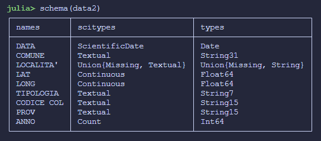
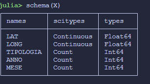
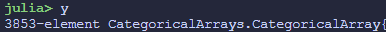
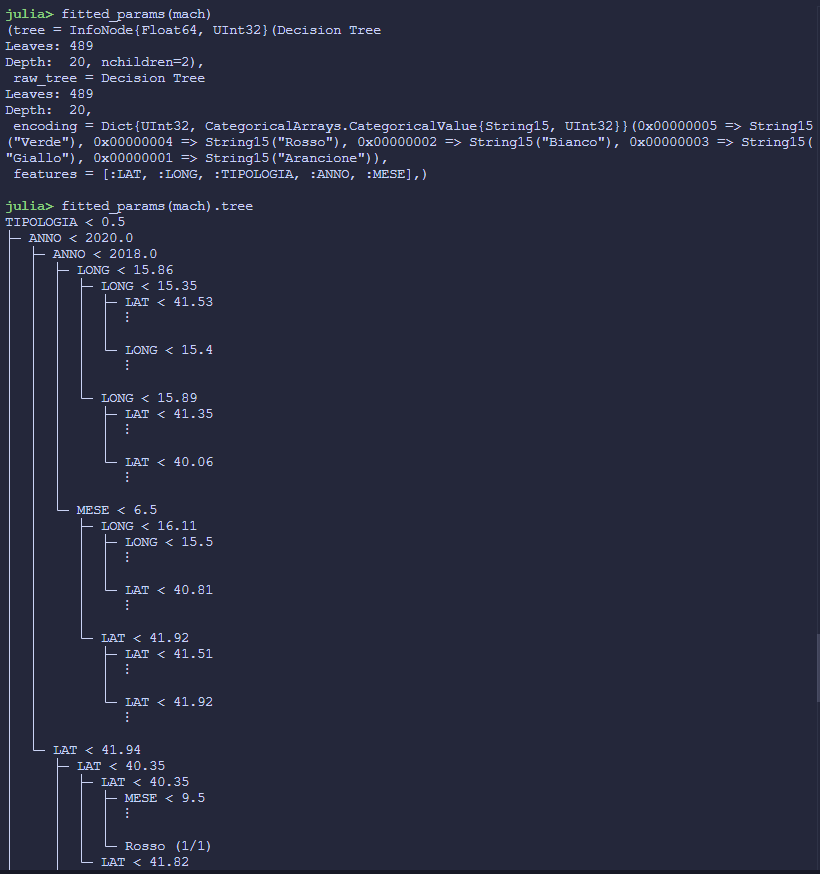
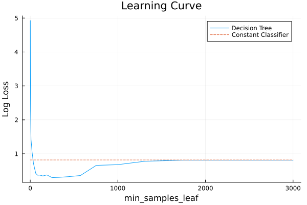
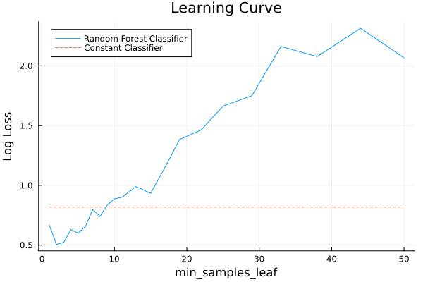
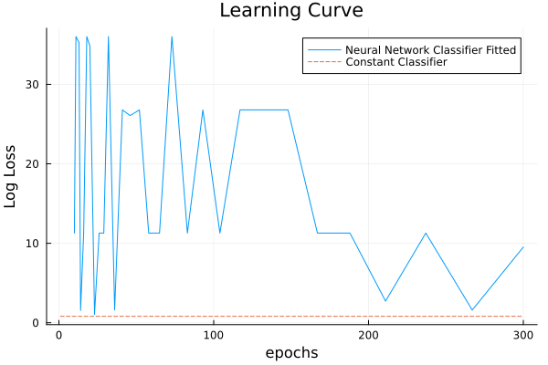

---
title: "Approfondimento Incendi Boschivi Pugliesi"
author: [Losurdo Mauro]
subtitle: "[https://github.com/Switcha57/juliaTest](https://github.com/Switcha57/juliaTest)"
keywords: [Icon project]
titlepage-color: "FFFFF0"
toc-own-page: true
titlepage: true
toc: true
output:
  pdf_document:
    md_extensions: +link_attributes
...
# 1. Introduzione

il presente caso di studio si propone, tramite uno studio del dataset fornito dalla regione puglia[^Puglia-dataset], di ricavare informazioni utili per la prevenzioni degli incendi.


## 1.1. Requisiti funzionali

Il progetto è stato realizzato in Julia è un linguaggio di programmazione ad alte prestazioni, progettato per il calcolo numerico e scientifico, che combina la velocità del C con la facilità d'uso di Python.

librerie utilizzate

- MLJ.ij[@Blaom2020]


# 2. Dataset 

## 2.1. informazioni base

Il dataset dataset-incendi-vito-martella.csv contiene informazioni sugli incendi avvenuti in diverse località della regione Puglia. Ogni riga rappresenta un singolo evento di incendio e include le seguenti colonne:

1. DATA: La data dell'incendio (formato YYYY-MM-DD).
1. COMUNE: Il comune in cui è avvenuto l'incendio.
1. LOCALITA': La località specifica all'interno del comune.
1. LAT: La latitudine della località dell'incendio.
1. LONG: La longitudine della località dell'incendio.
1. TIPOLOGIA: Il tipo di area colpita dall'incendio (es. Bosco, Macchia).
1. CODICE COL: Un codice colore associato all'incendio (es. Arancione).
1. PROV: La provincia in cui si trova il comune.
1. ANNO: L'anno in cui è avvenuto l'incendio.

## 2.2. Preprocessing

Il dataset non è malformato, non presente ne righe con valori nulli ne righe duplicate
è una matrice 3854 * 9 



{#id1 .class width=400 height=300}

{#id2 .class width=400 height=300}


{#id3 .class width=400 height=300}


{#id4 .class width=400 height=300}

# 3. Analisi del problema

Analizzando il dataset, possiamo modella un Problema di classificazione avente

- Feature di _input_
  - LAT
  - LONG
  - TIPOLOGIA
  - ANNO 
  - MESE
  - 

- Feature Target
  -  Codice Col
  -  


Per semplicità di addestramento dei modelli ho preferito trasformare Tipologia da feature Categorica a una feature numerica Intera, tramite un semplice mapping dei valori 

```julia
data[!, :TIPOLOGIA] = Int64.(replace(data[!, :TIPOLOGIA], "Bosco" => 0, "Canneto" => 1, "Macchia" => 2))
```

le feature non nominate sono state trascurate, perché o ricavabili da altre colonne (:DATA) o non particolarmente rilevanti e difficili da gestire poiché di natura testuale (:PROV, ;COMUNE,:LOCALITA')

teoria riguardo i modelli derivano tutto da [@Poole_Mackworth_2023]
## 3.1. Apprendimento Supervisionato


### 3.1.1. Albero di decisione

Come modello di predizione ho scelto un Albero di Decisione



#### 3.1.1.1. Performance 

Per l'addestramento ho optato per una strategia di HoldOut cioè dato il dataset è stato diviso in modo tale da avere 70% casi di esempio e 30% casi di test. Ad ogni iterazione del modello si è effettuato un mescolamento delle due classi.

{#id3 .class width=400 height=300}

Come parametro da ottimizzare ho scelto min_samples_leaf (equivalente ad min_number_examples). 
Per dare una base di valutazione sull'efficacia dei vari modelli nei grafici è presente anche l'errore ottenuto da un predittore "costante" cioè che non valuta le feature in input ma risponde soltanto tenendo in considerazione la distribuzione della feature target nel dataset.

Possiamo quindi notare che al aumento della soglia del numero minimo di esempi per un nuovo nodo-figlio, aumenta l'errore del predittore e superato ~1500 ha performance pari ad al classificatore costante dato che il predittore non generalizza abbastanza.


## 3.2. Modelli Compositi

Invece di usare la predizione di un singolo predittore, si combinano le predizone di un numero di modelli semplici.

Dato il numero ridotto di feature di input (5) non è possibile apprezzare l'aumento di efficacia data la diversità degli alberi.

### 3.2.1. Bagging 

Come modello ho scelto la Random Forest Classifier, che usa la strategia di bagging per sfruttare della presenza di piu di un albero di decisione. 

#### 3.2.1.1. Performance

{#id3 .class width=400 height=300}

Si puo notare che la presenza di piu alberi di decisione (in questo caso è stato fissato a 100) c'è bisogno di un valore minore di min_samples_leaf per ottenere prestazione ottimale, e le prestazioni degenerano molto piu velocemente all'aumentare del parametro 

## 3.3. Neural Network 

Le reti neurali artificiali (Artificial Neural Networks, ANN) sono modelli computazionali ispirati alla struttura e al funzionamento del cervello umano. Sono composte da nodi (neuroni) organizzati in strati (layers). Le ANN sono particolarmente efficaci per problemi complessi come il riconoscimento di immagini, la traduzione automatica e la predizione di serie temporali.

### 3.3.1. Feed Forward 

Il modello di rete neurale feed forward è uno dei più semplici e comuni. In una rete feed forward, l'informazione fluisce in una sola direzione: dai nodi di input, attraverso i nodi nascosti (hidden layers), fino ai nodi di output. Non ci sono cicli o loop nel processo di propagazione dell'informazione.

#### 3.3.1.1. Performance


{#id7 .class width=400 height=300}

Le bassissime performance del modello di rete neurale feed forward possono essere attribuite a diversi fattori:

1. **Numero di feature limitato**: Con solo 5 feature di input, il modello potrebbe non avere abbastanza informazioni per fare predizioni accurate.
2. **Overfitting**: Il modello potrebbe adattarsi troppo ai dati di training e non generalizzare bene ai dati di test.
3. **Iperparametri non ottimali**: La scelta degli iperparametri (come il numero di neuroni, il tasso di apprendimento, ecc.) potrebbe non essere ottimale per questo dataset specifico.

Caratteristiche del modello di neural network che ha ottenuto miglioro risultati
```bash
(fitresult = (NeuralNetworkEstimator - A 5-dimensions 4-layers feedfordward neural network (fitted on 3853 records)
Cost function:
crossentropy
Optimisation algorithm:
BetaML.Nn.ADAM(BetaML.Nn.var"#118#121"(), 1.0, 0.9, 0.999, 1.0e-8, BetaML.Nn.Learnable[BetaML.Nn.Learnable{Float64}(([0.0 0.0 … 0.0 0.0; 2.5355425003642376e-227 1.0414033209250513e-227 … 1.2527678251759454e-225 4.62320343023331e-228; … ; 0.0 0.0 … 0.0 0.0; 7.984990522445618e-229 3.2775579865077397e-229 … 3.944824865908032e-227 1.4573997706205151e-229], [0.0, 6.2089312257445225e-229, 3.867572140582305e-229, -1.717601567850873e-229, 4.375821970199769e-229, 0.0, 0.0, 1.9551259145087475e-230])), BetaML.Nn.Learnable{Float64}(([0.0 4.8144965424625996e-226 … 0.0 3.264385629333955e-227; 0.0 8.09663062846607e-228 … 0.0 5.5483887929192145e-229; … ; 0.0 0.0 … 0.0 0.0; 0.0 4.045215389997103e-226 … 0.0 2.742787926048173e-227], [5.59308322785238e-229, 9.414626269538757e-231, -6.142201457321955e-229, 7.743365144931992e-230, 0.0, 0.0, 0.0, 4.699396115729764e-229])), BetaML.Nn.Learnable{Float64}(([0.0 0.0 … 0.0 0.0; 8.610582936890514e-226 5.773992743348438e-232 … 0.0 3.2014121674486013e-227; … ; 0.0 0.0 … 0.0 0.0; -8.610582936890512e-226 -5.773992743348438e-232 … 0.0 -3.201412167448601e-227], [0.0, 9.489806082622746e-229, 0.0, 0.0, -9.489806082622746e-229])), BetaML.Nn.Learnable{Float64}(())], BetaML.Nn.Learnable[BetaML.Nn.Learnable{Float64}(([0.0 0.0 … 0.0 0.0; 0.0 0.0 … 0.0 0.0; … ; 0.0 0.0 … 0.0 0.0; 0.0 0.0 … 0.0 0.0], [0.0, 0.0, 0.0, 0.0, 0.0, 0.0, 0.0, 0.0])), BetaML.Nn.Learnable{Float64}(([0.0 0.0 … 0.0 0.0; 0.0 0.0 … 0.0 0.0; … ; 0.0 0.0 … 0.0 0.0; 0.0 0.0 … 0.0 0.0], [0.0, 0.0, 0.0, 0.0, 0.0, 0.0, 0.0, 0.0])), BetaML.Nn.Learnable{Float64}(([0.0 0.0 … 0.0 0.0; 0.0 0.0 … 0.0 0.0; … ; 0.0 0.0 … 0.0 0.0; 0.0 0.0 … 0.0 0.0], [0.0, 0.0, 0.0, 0.0, 0.0])), BetaML.Nn.Learnable{Float64}(())])
Layers:
#        # In             # Out                   Type
1        (5,)            (8,)            BetaML.Nn.DenseLayer{typeof(BetaML.Utils.relu), typeof(BetaML.Utils.drelu), Float64}
2        (8,)            (8,)            BetaML.Nn.DenseLayer{typeof(BetaML.Utils.relu), typeof(BetaML.Utils.drelu), Float64}
3        (8,)            (5,)            BetaML.Nn.DenseLayer{typeof(BetaML.Utils.relu), typeof(BetaML.Utils.drelu), Float64}
4        (5,)            (5,)            BetaML.Nn.VectorFunctionLayer{0, typeof(BetaML.Utils.softmax), typeof(BetaML.Utils.dsoftmax), Nothing, Float64}
Output of `info(model)`:
- par_per_epoch:        Any[]
- yndims:       5
- fitted_records:       3853
- nLayers:      4
- nPar: 165
- loss_per_epoch:       Float64[]
- nepochs_ran:  200
- xndims:       5
, A BetaML.Utils.OneHotEncoder BetaMLModel (fitted)
Output of `info(model)`:
- n_categories: 5
- fitted_records:       3853
),)
``` 

# 4. Sviluppi futuri

Si potrebbe usare delle ontologie per poter aggiungere nuove feature nel dataset che potrebbero essere rilevanti tipo caratteriste del suolo e peculiarità meteorologiche della zona, dato che nel addestramento non si sono ottenuti ottimi risultati per mancanza di feature di input

# 5. Rifermenti Bibliografici
::: {#refs}
:::


[^Puglia-dataset]: https://dati.puglia.it/ckan/dataset/eventi-incendi-2017-2024.rdf
